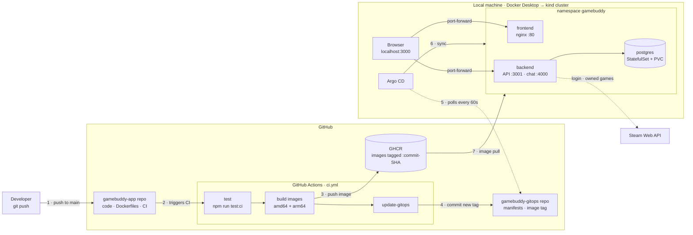

# GameBuddy

Match with other Steam players who own the same games and share your free
time, then chat in a session room. PERN stack: PostgreSQL, Express, React, Node.

```
Backend/    Express REST API (:3001) + Socket.IO chat server (:4000)
Frontend/   React (Create React App), served by nginx in Docker
```

This repo holds the application code, Dockerfiles and docker-compose.
Kubernetes manifests live in
[sgtCrunch/gamebuddy-gitops](https://github.com/sgtCrunch/gamebuddy-gitops),
which Argo CD watches.

## How it deploys



1. **Push** to `main` in this repo: the only manual step.
2. **CI** (`.github/workflows/ci.yml`) runs the backend unit tests; if they fail, nothing ships.
3. **Build and publish:** backend and frontend images are built for amd64 and arm64 and pushed to GHCR, tagged with the commit SHA (never `latest`).
4. **Record the deploy:** CI commits the new tag to `overlays/local/kustomization.yaml` in [gamebuddy-gitops](https://github.com/sgtCrunch/gamebuddy-gitops). CI never touches the cluster.
5. **Argo CD**, running inside the cluster, polls the GitOps repo every 60 seconds and sees the change.
6. **Sync:** Argo CD applies the manifests; Kubernetes rolls the Deployments to the new tag (new Pods start before old ones stop).
7. **Pull:** the cluster pulls the new images from GHCR, and the app is live.

**Rollback:** revert the *"Deploy …"* commit in the GitOps repo; Argo CD puts the previous image back within a minute, with no rebuild needed.

## Run with Docker

```bash
cp .env.example .env      # add your STEAM_API_KEY for Steam login
docker compose up --build
```

Open http://localhost:3000. Postgres starts with the schema from
`Backend/gb-schema.sql` loaded on first run (data lives in the `db-data`
volume; `docker compose down -v` resets it).

Without `STEAM_API_KEY` the app still starts, but `/auth/steam` returns 503.

## Configuration

Backend (set in `docker-compose.yml`):

| Variable | Default | Purpose |
|---|---|---|
| `DATABASE_URL` | `gamebuddy` | Postgres connection string |
| `DATABASE_SSL` | on when `NODE_ENV=production` | `false` for a local/compose Postgres |
| `SECRET_KEY` | `secret-dev` | JWT signing secret |
| `PORT` | `3001` | REST API port |
| `CHAT_PORT` | `4000` | Socket.IO chat port |
| `API_URL` | `http://localhost:3001` | Public API URL (Steam OpenID realm/return URL) |
| `FRONTEND_URL` | `http://localhost:3000` | Post-login redirect and chat CORS origin |
| `STEAM_API_KEY` | none | Steam Web API key |

Frontend (build args; Create React App bakes them into the bundle):

| Variable | Default |
|---|---|
| `REACT_APP_BASE_URL` | `http://localhost:3001` |
| `REACT_APP_CHAT_URL` | `http://localhost:4000` |

## Run on Kubernetes (kind)

See [gamebuddy-gitops](https://github.com/sgtCrunch/gamebuddy-gitops):
`./scripts/bootstrap.sh` there creates a kind cluster with Argo CD, which
then deploys the images CI builds from this repo.

## CI/CD

`.github/workflows/ci.yml` runs on every push to `main`:

1. **Test**: `npm run test:ci` in `Backend/`
2. **Build + push**: backend and frontend images (linux/amd64 + arm64) to
   `ghcr.io/sgtcrunch/gamebuddy-{backend,frontend}:<commit SHA>`
3. **Deploy**: commits the new tag to
   [gamebuddy-gitops](https://github.com/sgtCrunch/gamebuddy-gitops)
   (`overlays/local/kustomization.yaml`), which Argo CD syncs

Needs an Actions secret `GITOPS_TOKEN`: a fine-grained personal access token
with **Contents: Read and write** on `sgtCrunch/gamebuddy-gitops` only.

### Tests

| Suite | Status |
|---|---|
| `Backend/helpers`, `Backend/middleware` (17 unit tests) | pass; run in CI |
| `Backend/models`, `Backend/routes`, `config.test.js`, `app.test.js` | fail: written for the Jobly template project (password/first_name columns, `jobly` DB) and never updated for GameBuddy |
| `Frontend/src/App.test.js` | fails: default Create React App test ("learn react"); Jest also cannot load axios' ES module |

## Run without Docker

```bash
createdb gamebuddy && psql gamebuddy < Backend/gb-schema.sql
cd Backend && npm install && npm start     # :3001 and :4000
cd Frontend && npm install && npm start    # :3000
```
